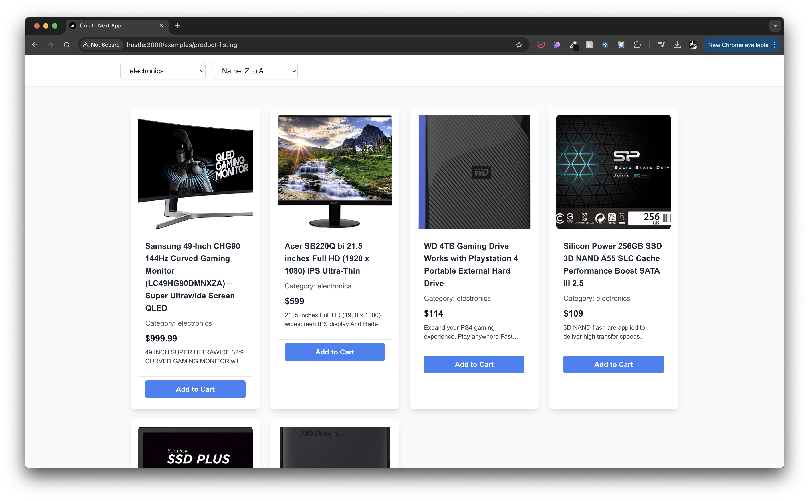

**Architecture Guide: Building Scalable React (or React Native) Apps with Zustand & React Query**  
*Modern state management and data fetching patterns for production apps*

---

Here, I'll share my approach to creating a clean architecture with Zustand stores, custom hooks, React Query, and UI components. I’ll explore how to keep business logic in custom hooks, avoid mixing it with stores, and manage API calls effectively. My goal is to structure these layers in a **maintainable** way while ensuring **flexibility** and **separation of concerns**.


### **Core Technologies**  
#### **Zustand** (State Management)  
- 🚀 **Minimal Boilerplate**: Simple store creation with automatic re-renders  
- 🔒 **Immutable State**: Built-in immutable updates via `set` method  
- 🧩 **Middleware Support**: Extend with persistence, logging, or custom logic  
- 🔄 **Cross-Store Operations**: Access multiple stores in business logic  
- 📦 **TypeScript First**: Full type safety out of the box  

#### **React Query** (Server State Management)  
- 🌐 **Smart Caching**: Automatic cache management and deduping  
- ⚡ **Background Updates**: Silent server synchronization  
- 🛠 **Mutations**: Optimistic updates and error rollbacks  
- 🔄 **Auto Revalidation**: Stale-while-revalidate strategy  
- 🧩 **Hooks-based API**: Seamless integration with React components  

### **Folder Structure**  
```
zustand-react-query-demo/  
├── src/  
│   ├── app/ 
│   ├── examples/
│   │   └── product-listing/
│   │       ├── api/
│   │       │   ├── fetchCategories.ts
│   │       │   └── fetchProducts.ts
│   │       ├── components/
│   │       │   ├── Product.tsx
│   │       │   └── TopBar.tsx
│   │       ├── hooks/
│   │       │   ├── useCategory.ts
│   │       │   └── useProducts.ts
│   │       ├── store/
│   │       │   └── useProductStore.ts
│   │       └── ProductList.tsx
├── tailwind.config.ts
├── package.json
└── next.config.ts
```

### **Architecture Principles**  
  
*Visual representation of the data flow*

1. **UI Layer (Dumb Components)**  
   - 💻 Only handles presentation and user interactions  
   - 🔗 Uses custom hooks for all business logic  
   - 🚫 No direct store/API access  

```tsx
// ProductList.tsx
const ProductList: FC = () => {
  const { data: products, isLoading, error } = useProducts()

  if (isLoading) {
    return (
      <div className="flex items-center justify-center min-h-[400px]">
        <p className="text-lg">Loading products...</p>
      </div>
    );
  }

  if (error) {
    return (
      <div className="flex items-center justify-center min-h-[400px]">
        <p className="text-lg text-red-500">Error loading products</p>
      </div>
    );
  }

  return (
    <div className="min-h-screen bg-gray-50">
      <TopBar />
      <div className="max-w-7xl mx-auto">
        {/* Product grid */}
      </div>
    </div>
  );
};
```

2. **Business Layer (Custom Hooks)**  
   - 🧠 Contains all business logic and side effects  
   - 🔗 Orchestrates Zustand stores and React Query  
   - ♻️ Reusable across components/features  

```tsx
// useProducts.ts
const useProducts = () => {
  const { selectedCategory, sortOrder } = useProductStore();

  const products = useQuery<ProductType[]>({
    queryKey: ['products', selectedCategory, sortOrder],
    queryFn: async () => {
      // If category is selected, use category-specific endpoint
      if (selectedCategory) {
        return fetchCategoryProducts(selectedCategory, sortOrder || undefined);
      }
      // Otherwise use main products endpoint
      return fetchProducts(sortOrder || undefined);
    },
    staleTime: 1000 * 60 * 2, // Use the cache value till 2 minutes have passed
  });

  return products;
};
```

3. **State Layer (Zustand Stores)**  
   - 📦 Simple state containers  
   - 📤 Only basic setters/getters  
   - 🚫 No business logic  

```tsx
// useProductStore.ts
const useProductStore = create<ProductStore>((set) => ({
  selectedCategory: '',
  sortOrder: '',
  hasLoadedCategories: false,
  setSelectedCategory: (category) => set({ selectedCategory: category }),
  setSortOrder: (order) => set({ sortOrder: order }),
  setHasLoadedCategories: (loaded) => set({ hasLoadedCategories: loaded })
}));
```

4. **API Layer (React Query)**  
   - 🌐 Handles server communication  
   - 🔄 Automatic caching/revalidation  
   - 🛡 Type-safe API definitions  

```tsx
// api/fetchProducts.ts
export const fetchProducts = (sort?: string): Promise<ProductType[]> => 
  fetch(`https://fakestoreapi.com/products${sort ? `?sort=${sort}` : ''}`).then(res => res.json());

export const fetchCategoryProducts = (category: string, sort?: string): Promise<ProductType[]> =>
  fetch(`https://fakestoreapi.com/products/category/${category}${sort ? `?sort=${sort}` : ''}`).then(res => res.json());
```

---

### **Key Benefits**  
1. **Separation of Concerns**  
   - UI: Only presentation  
   - Business Logic: Centralized in hooks  
   - State: Simple storage  
   - API: Clean data fetching  

2. **Reusable Logic**  
   - Custom hooks compose multiple stores/APIs  
  

3. **Testability**  
   - Isolated store tests  
   - Mocked API tests  
   - Hook behavior tests  

4. **Type Safety**  
   - End-to-end TypeScript support  
   - Shared types across layers  

5. **Scalability**  
   - Add features without refactoring  
   - Predictable patterns for team members  

---

### **FAQ**  
**Q: How to handle complex cross-store operations?**  
```ts
// useThemeSetup.ts
export const useThemeSetup = () => {
  const {user} = useUserStore();
  const {setTheme} = useUiStore();
  
  useEffect(() => {
    if(user?.preferences?.theme) {
      setTheme(user.preferences.theme);
    }
  }, [user?.preferences]);
};
```

**Q: Where to put shared validation logic?**  
```ts
// authValidators.ts
export const validateToken = (token: string) => {
  // Pure validation logic
  return isValid;
};
```

**Q: How to prevent duplicate API calls?**  
```ts
// useUserData.ts
export const useUserData = (userId: string) => {
  return useQuery({
    queryKey: ['user', userId],
    queryFn: () => userApi.get(userId),
    staleTime: 5 * 60 * 1000
  });
};
```

---

This architecture combines Zustand's lightweight state management with React Query's powerful data synchronization, creating a robust foundation for complex applications. By strictly separating concerns and centralizing business logic in custom hooks, we achieve maintainable, testable, and scalable code that grows gracefully with your application's needs.

### **Output**  
  
*Output of the example*

## Getting Started
This is a [Next.js](https://nextjs.org) project bootstrapped with [`create-next-app`](https://nextjs.org/docs/app/api-reference/cli/create-next-app).

First, run the development server:

```bash
npm run dev
# or
yarn dev
# or
pnpm dev
# or
bun dev
```

Open [http://localhost:3000](http://localhost:3000) with your browser to see the result.

If this repo is useful to you, consider starring it! 🌟😊

Feel free to raise issues and contribute! 🙌
